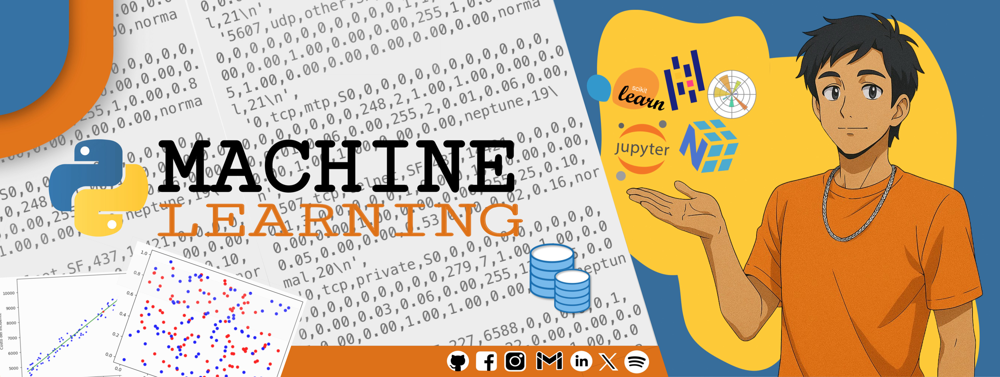

# ✉️ EMAIL DETECTOR

This linear model was trained with both preprocessed data and raw data ingestion, with the purpose of detecting ham and spam emails. The dataset was collected by the University of New Brunswick in 2007, aiming to mathematically understand data behavior and apply critical thinking toward identifying the optimal model.

[](https://www.python.org/downloads/release/python-31014/)
[](https://www.anaconda.com/docs/getting-started/getting-started)
[](https://jupyter-notebook.readthedocs.io/en/latest/notebook.html)
[](https://numpy.org/install/)
[](https://pandas.pydata.org/docs/getting_started/install.html)
[](https://scikit-learn.org/stable/install.html)



## 🎯 Features

* **Manual introduction** with a real-world Excel example
* **Introduction to Python** - libraries commonly used in data science
* **Basic mathematical** models for analysis and prediction
* **Expository documentation** for each concept
* **Hands-on practices** applying the presented models

## 🛠️ Technologies Used

### Development environment

* **Anaconda Navigator 2.6+** – Environment configuration and workspace management

### Programming lenguage

* **Terminal** – Installation of libraries and packages
* **Python3** - Code development.
* **Jupyter Notebook** – Code development and documentation

### Libraries & Frameworks

* **NumPy** – Mathematical operations and data structures
* **Pandas** – Data manipulation and analysis
* **Matplotlib** – Data visualization
* **Scikit-learn** – Training of classic ML models and clustering

## 📦 Installation and Configuration

### Requirements

* Python 3.10+ (stable version)
* Linux operating system (any distribution, recommended)
* Virtual environment in Anaconda Navigator

### 1. Clone the repository

```bash
git clone https://github.com/TerrazasJr316/email-detector.git
cd linear-forecasting
```

### 2. Launch the virtual environment

```bash
# to create
~$ conda create -n environment_name python=version anaconda
# to activate
~$ source activate environment_name
# to desactivate
~$ conda deactivate
```

[Managing Environment](https://www.anaconda.com/docs/tools/anaconda-navigator/tutorials/manage-environments)

### 3. Install required libraries

```bash
# conda
conda install anaconda::numpy
conda install anaconda::pandas
conda install anaconda::matplotlib
conda install anaconda::scikit-learn
conda install anaconda::jupyter
# pip
pip install numpy
pip install pandas
pip install matplotlib
pip install scikit-learn
```

### 4. Set the dataset path

recomended:

```bash
email-detector/data
```

## 🤖 Machine Learning workflow

### Model Training & Evaluation

* Logistic Regression
* Confusion Matrix
* ROC and PR Curves

### Data Transformation & Pipelines

* Transformers
* Pipelines for preprocessing and modeling

### Visualization & Analysis

* Correlation Matrix
* Model performance plots

## 📁 Project Structure

```bash
EMAIL-DETECTOR/
├── data/               # DataSet resource
├── models/             # linear models
├── nltk_data/          # stopwords
├── overview/           # first steps
├── custom_transformers_and_pipelines.ipynb
├── data_visualization.ipynb
├── dataset_preprocessing.ipynb
├── dataset_splitting.ipynb
├── model_evaluation-full.ipynb
└── model_evaluation.ipynb
```

## 🐛 Troubleshooting

**Error: "download stopwords"**.

* **Email parsing - logistic_refression**

```python
# save under the user home directory
import nltk
nltk.download('stopwords')

# save to speific location
import nltk
import os

route_download = "/specific/location/nltk_data"
nltk.download('stopwords', download_dir=route_download)

if route_download not in nltk.data.path:
    nltk.data.path.append(route_download)
```

* **Error: parser files arff in kernel - data_visualization**

```python
import sys

!{sys.executable} -m pip install liac-arff
```

**Error: download arff**.

* **Import arff - data_splitting**

```python
# pip
pip install arff

# conda
conda install auto::arff
```

## ❓ FAQ

* [How to activate conda environment](https://es.stackoverflow.com/questions/335525/como-activar-conda-environment/339487#339487)
* [Managing environments](https://www.anaconda.com/docs/tools/anaconda-navigator/tutorials/manage-environments)
* [What's Logistic Regression?](https://www.ibm.com/mx-es/think/topics/logistic-regression)
* [What is Machine Learning?](https://aws.amazon.com/es/what-is/machine-learning/)

## ✉️ Contact me & Social Media

### 💻 Computer Systems Engineering

Adaptable and flexible in different work environments, with strong critical thinking, solid problem-solving skills, and a collaborative, responsible mindset. My strongest areas are backend development, databases, and machine learning.

If you find this project useful, you can support it by giving a "☆ Star" to the repository.


[](https://facebook.com/josue.terrazasmendoza)
[](https://instagram.com/jos_mdz316/)
